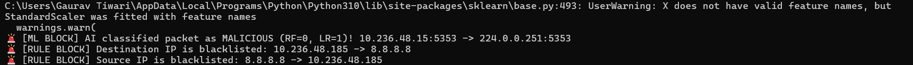
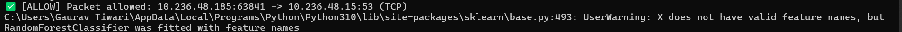

# 🔥 AI-Powered Network Security Framework

A powerful Python-based firewall that performs real-time packet filtering using traditional rule-based methods, deep packet inspection (DPI) via regex, and machine learning models (Random Forest, Logistic Regression) for malicious traffic detection. Also integrates **JA3 TLS fingerprinting** to monitor encrypted traffic anomalies.

---
## 🪟 Windows Support (Active Prevention)
Unlike traditional Linux-only firewalls, this project includes a custom Windows engine (`windows_active_firewall.py`). 
By utilizing `pydivert` (WinDivert), it actively intercepts and drops malicious packets directly from the Windows network stack in real-time.


## 📌 Features

- 🔒 **IP and Port Filtering**: Block traffic based on blacklists.
- 🧪 **DPI via Regex**: Detect malicious patterns like SQL Injection in payloads.
- 🤖 **Machine Learning Detection**: Predicts if packets are malicious using trained ML models.
- 📊 **TLS JA3 Fingerprinting**: Identify anomalies during encrypted handshakes.
- 📦 Built using `Scapy`, `NetfilterQueue`, and `Flask` for core logic and APIs.

---

## 🖼️ Screenshots

### 1️⃣ Hybrid ML + Rule-Based Filtering
Combines Machine Learning detection with rule-based blacklist filtering to identify and block suspicious traffic in real time.



<p align="center">
<b>Action:</b> Malicious packets and blacklisted IP traffic are automatically blocked.
</p>

---

### 2️⃣ Allowed Legitimate Traffic
Demonstrates safe and legitimate network traffic being allowed through the firewall without interruption.



<p align="center">
<b>Status:</b> Legitimate packets are successfully identified and allowed.
</p>
---

## ⚙️ Tech Stack

- **Python**
- **Scapy**, **NetfilterQueue**
- **Flask** (for API)
- **JA3 fingerprinting**
- **sklearn** (ML models: RF & LR)
- **Regex** for DPI
- **Wireshark** for verification

---

## 🚀 How to Run

```bash
# (1) Setup virtual environment
python3 -m venv venv
source venv/bin/activate
pip install -r requirements.txt

# (2) Load firewall rules
sudo iptables -I OUTPUT -j NFQUEUE --queue-num 0
sudo iptables -I FORWARD -j NFQUEUE --queue-num 0

# (3) Run the firewall
sudo python3 firewall.py


---

## © Copyright & License

**Author:** Gaurav Tiwari  

This project is provided for educational and portfolio purposes only.  
Unauthorized copying, redistribution, modification, or commercial use of this project is prohibited without explicit permission from the author.

You may fork this repository for personal learning and research purposes, but you may not claim this work as your own.

See the `LICENSE` file for more details.