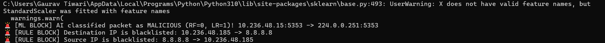
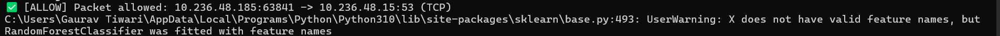

# AI-Powered Network Security Framework

A Python packet-inspection firewall with seven ordered detection layers — static
rules, fragment sanity, signature DPI over reassembled streams, Shannon entropy
heuristics, behavioural detection, JA3 TLS fingerprinting, and flow-level
machine learning.

Runs on **Linux** (NetfilterQueue) and **Windows** (WinDivert). Both platforms
share one detection core, so they cannot drift apart.

---

## Architecture

```
                    ┌─────────────────────┐
   iptables ───────▶│                     │
   (NFQUEUE)        │  detection_engine   │──▶ Verdict(block, score, reasons)
   WinDivert ──────▶│                     │
                    └─────────┬───────────┘
                              │
                    ┌─────────┴───────────┐
                    │   flow_tracker      │  bidirectional flow state
                    │   config            │  every tunable
                    └─────────────────────┘
```

| File | Role |
|------|------|
| `detection_engine.py` | All detection logic. Platform-independent and importable without a capture driver. |
| `flow_tracker.py` | Bidirectional flow state, CICFlowMeter-compatible features, entropy. |
| `config.py` | Rules, signatures, thresholds, policy. |
| `dpi_firewall.py` | Linux front-end (NetfilterQueue). |
| `windows_active_firewall.py` | Windows front-end (WinDivert). |
| `demo_sniffer.py` | Passive mode — classifies live traffic, drops nothing. |
| `basic_firewall.py` | Minimal rule-only example, for reading. |
| `train_firewall_model.py` | Trains the RF / LR models from CSE-CIC-IDS2018. |
| `tests/test_detection.py` | 61 regression tests. |
| `landing/index.html` | Project landing page. |

---

## Detection layers

Evaluated cheapest first. Each layer contributes a weighted score; the packet is
dropped once the total reaches `BLOCK_THRESHOLD` (default 80).

| # | Layer | Catches |
|---|-------|---------|
| 0 | **Allowlist** | Loopback, DHCP, link-local — never dropped, so the engine can't lock you out |
| 1 | **Static rules** | IP and port blacklists |
| 2 | **Fragment sanity** | Tiny-first-fragment evasion, fragment floods |
| 3 | **Signature DPI** | SQLi, XSS, traversal, SSRF, command injection, Log4Shell, Shellshock, scanner UAs |
| 4 | **Entropy** | DNS tunnelling, high-entropy payloads on cleartext ports |
| 5 | **Behaviour** | Port scans, SYN floods |
| 6 | **JA3** | Known-malicious TLS client fingerprints |
| 7 | **Flow ML** | Random Forest + Logistic Regression consensus over flow features |

Signatures are matched against a **reassembled per-direction stream**, not
individual packets, so a payload deliberately split across TCP segments is still
caught.

---

## Quickstart

```bash
pip install -r requirements.txt
```

The platform packet driver resolves automatically — `NetfilterQueue` on Linux,
`pydivert` on Windows. Neither builds on the other platform.

### 1. Watch first (no driver, no root)

```bash
python demo_sniffer.py --quiet
```

Classifies live traffic and prints what each layer would decide. Nothing is
dropped. Capture still needs Npcap + Administrator on Windows, or sudo on Linux.

### 2. Run the tests

```bash
python -m pytest tests/ -v
```

### 3. Enforce — Windows (Administrator)

```bash
python windows_active_firewall.py --monitor
```

```bash
python windows_active_firewall.py
```

### 4. Enforce — Linux (root)

```bash
sudo iptables  -I INPUT  -j NFQUEUE --queue-num 0
sudo iptables  -I OUTPUT -j NFQUEUE --queue-num 0
sudo ip6tables -I INPUT  -j NFQUEUE --queue-num 0
sudo ip6tables -I OUTPUT -j NFQUEUE --queue-num 0
```

```bash
sudo python3 dpi_firewall.py --monitor
```

Remove the rules when you are finished:

```bash
sudo iptables -D INPUT -j NFQUEUE --queue-num 0
```

Both front-ends accept `--monitor` (log only) and `-v` (debug logging), and
print a session summary on Ctrl+C.

---

## The ML layer ships in monitor-only mode

`ML_ENFORCE = False` by default. The models score and log but never drop a
packet until you enable them deliberately.

This is not caution for its own sake. The bundled models were trained on
CSE-CIC-IDS2018 *flow* records from 2018, and have not been validated against
your network. Turn them on only after reviewing what they flag in monitor mode:

```python
# config.py
ML_ENFORCE = True
```

Rules, DPI and heuristics do the enforcing either way.

### Why flow tracking exists

The models expect 70 CICFlowMeter columns describing a whole conversation:
duration, inter-arrival timing, per-direction volumes. Scoring a single packet
leaves 53 of those 70 inputs constant at zero — the columns carrying the signal
are all dead, and the classifier degenerates into a payload-size threshold.

`flow_tracker.py` reconstructs real flow records from live packets, and the ML
layer abstains entirely below `ML_MIN_PACKETS` (default 8) because a flow-trained
model has nothing meaningful to say about a two-packet flow.

---

## Configuration

Everything lives in `config.py`:

| Setting | Default | Meaning |
|---------|---------|---------|
| `BLOCK_THRESHOLD` | `80` | Score at which a packet is dropped |
| `FAILURE_MODE` | `"open"` | `open` accepts on engine error, `closed` drops |
| `ML_ENFORCE` | `False` | Whether ML can contribute to a drop |
| `ML_MIN_PACKETS` | `8` | Flow size below which ML abstains |
| `ML_REQUIRE_CONSENSUS` | `True` | Require both RF and LR to agree |
| `PORT_SCAN_THRESHOLD` | `15` | Distinct ports in `PORT_SCAN_WINDOW` (10s) |
| `SYN_FLOOD_THRESHOLD` | `100` | SYNs in `SYN_FLOOD_WINDOW` (5s) |
| `MAX_TRACKED_FLOWS` | `20000` | Flow table cap (LRU eviction) |
| `ALLOWLISTED_CIDRS` | loopback, link-local, multicast | Never dropped |

Add your own signatures as `(compiled_pattern, label, severity)` tuples in
`MALICIOUS_SIGNATURES`. Patterns are matched against **bytes**, so use `rb"..."`.

---

## Training your own models

Download CSE-CIC-IDS2018 (see [DATASET_CREDITS.md](DATASET_CREDITS.md)), point
`DATASET_PATH` in `train_firewall_model.py` at the processed CSVs, then:

```bash
python train_firewall_model.py
```

Models are written to `trained_models/`. The engine refuses to load a model
whose feature count disagrees with `ML_FEATURE_COLUMNS` rather than producing
silent garbage on a shifted vector.

> The checked-in models were pickled with scikit-learn 1.7.1. Loading them under
> a different version prints an `InconsistentVersionWarning`. Retrain to clear it.

---

## Screenshots

### Hybrid ML + rule-based filtering



### Allowed legitimate traffic



---

## Tech stack

Python 3.10+ · Scapy · NetfilterQueue (Linux) · pydivert/WinDivert (Windows) ·
scikit-learn · pandas · numpy · pytest

---

## Scope

This is an educational and portfolio project, not a hardened production
appliance. It inspects and drops real traffic and should be run in `--monitor`
mode first on any machine you care about.

---

## Copyright & License

**Author:** Gaurav Tiwari

Provided for educational and portfolio purposes only. Unauthorized copying,
redistribution, modification, or commercial use is prohibited without explicit
permission. You may fork this repository for personal learning and research, but
you may not claim this work as your own.

See the [LICENSE](LICENSE) file for details.
